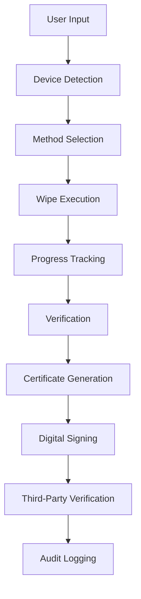

# SecureWipe Architecture Documentation

## Overview

SecureWipe is a cross-platform, standards-compliant data wiping application designed for trustworthy IT asset recycling. The architecture follows modular design principles with clear separation of concerns between platform-specific implementations and core business logic.

## System Architecture

```
SecureWipe/
|-- src/                        # Source code
|   |-- core/                    # Platform-agnostic core
|   |   |-- algorithms/          # Data wiping algorithms
|   |   |-- crypto/              # Cryptographic operations
|   |   |-- certificates/        # Certificate generation
|   |   |-- verification/        # Third-party verification
|   |-- platforms/               # Platform-specific code
|   |   |-- windows/            # Windows implementation
|   |   |-- linux/              # Linux implementation
|   |   |-- android/            # Android implementation
|   |-- ui/                     # User interfaces
|   |   |-- cli/                # Command-line interface
|   |   |-- gui/                # Web-based GUI
|   |-- tools/                  # Additional tools
|   |   |-- iso-creator/        # Bootable media creation
```

## Core Components

### 1. Data Wiping Algorithms (`core/algorithms/`)

**Purpose**: Implement NIST SP 800-88 Rev 2 compliant wiping methods

**Key Classes**:
- `NISTClearWipe`: User-addressable areas only
- `NISTPurgeWipe`: Complete sanitization including HPA/DCO
- `IEEEPurgeWipe`: Cryptographic/block erase for SSDs
- `WipeMethodFactory`: Method selection and management

**Features**:
- Support for multiple media types (HDD, SSD, NVMe, USB)
- Hidden area handling (HPA, DCO, DFA)
- Progress tracking and verification
- Standards compliance validation

### 2. Cryptographic Operations (`core/crypto/`)

**Purpose**: Handle digital signatures and certificate security

**Key Classes**:
- `DigitalSignatureManager`: RSA-based signing/verification
- `CertificateRevocationList`: Certificate revocation management
- `ThirdPartyVerifier`: External verification integration

**Features**:
- RSA-2048 with SHA-256 signatures
- PKI-based certificate chains
- Tamper-proof certificate generation
- QR code verification

### 3. Certificate Generation (`core/certificates/`)

**Purpose**: Create professional, verifiable certificates

**Key Classes**:
- `PDFCertificateGenerator`: Professional PDF certificates
- Multi-language support (English, Hindi, Bengali, Tamil, Telugu)

**Features**:
- Digitally signed PDF certificates
- JSON certificate format
- QR code integration
- Professional templates

### 4. Third-Party Verification (`core/verification/`)

**Purpose**: Enable external validation and audit trails

**Key Classes**:
- `ThirdPartyVerificationService`: External verification API
- `VerificationDashboard`: Web-based verification interface

**Features**:
- Online verification services
- Blockchain anchoring for immutable proof
- Audit trail logging
- Batch verification capabilities

## Platform-Specific Implementations

### Windows (`platforms/windows/`)

**Technologies**:
- Windows API for device access
- Win32 disk management
- PowerShell integration

**Features**:
- ATA command execution
- HPA/DCO handling via Windows APIs
- UAC elevation for privileged operations

### Linux (`platforms/linux/`)

**Technologies**:
- libblkid for device detection
- hdparm for ATA commands
- cryptsetup for cryptographic operations

**Features**:
- Direct block device access
- Kernel-level ATA command support
- Systemd integration

### Android (`platforms/android/`)

**Technologies**:
- Android Storage Access Framework
- Java/Kotlin native implementations
- Root access handling

**Features**:
- Internal/external storage wiping
- Mobile device management integration
- Enterprise deployment support

## User Interfaces

### Command-Line Interface (`cli/`)

**Features**:
- Interactive device selection
- One-click wiping with progress tracking
- Certificate generation
- Bootable media creation

**Commands**:
- `securewipe wipe` - Interactive wiping
- `securewipe list` - Device enumeration
- `securewipe verify` - Certificate verification
- `securewipe create-iso` - Bootable media creation

### Web GUI (`ui/gui/`)

**Technologies**:
- HTML5 with Tailwind CSS
- Responsive design
- Real-time progress updates

**Features**:
- Device discovery and selection
- Method selection with recommendations
- Progress visualization
- Certificate download
- Verification dashboard

## Security Architecture

### Data Protection

1. **In-Memory Security**: Sensitive data handled in secure memory
2. **No Data Logging**: No sensitive data written to logs
3. **Secure Deletion**: Temporary files securely wiped

### Certificate Security

1. **Digital Signatures**: RSA-2048 with SHA-256
2. **Key Management**: Secure key generation and storage
3. **Verification**: Multi-layer verification process

### Compliance

1. **NIST SP 800-88 Rev 2**: Complete standard compliance
2. **IEEE 2883-2022**: Modern sanitization standards
3. **Audit Trails**: Comprehensive logging for compliance

## Data Flow



## Performance Considerations

### Wipe Speed Optimization

1. **Parallel Processing**: Multi-threaded sector writing
2. **Direct I/O**: Bypass OS caching for direct device access
3. **Batch Operations**: Optimize block size per device type

### Memory Management

1. **Streaming Operations**: Large files processed in chunks
2. **Memory Cleanup**: Immediate cleanup of sensitive data
3. **Resource Limits**: Configurable memory usage limits

## Scalability

### Enterprise Features

1. **Batch Operations**: Multiple device wiping
2. **Network Deployment**: Centralized management
3. **API Integration**: RESTful API for automation

### Performance Scaling

1. **Concurrent Operations**: Multiple simultaneous wipes
2. **Resource Pooling**: Efficient resource utilization
3. **Load Balancing**: Distributed processing capabilities

## Reliability & Error Handling

### Error Recovery

1. **Checkpoint System**: Resume interrupted operations
2. **Verification Loops**: Multiple verification attempts
3. **Fallback Methods**: Alternative wiping approaches

### Data Integrity

1. **Hash Verification**: SHA-256 verification of wiped data
2. **Checksum Validation**: End-to-end data integrity checks
3. **Rollback Capabilities**: Safe operation rollback

## Deployment Architecture

### Standalone Deployment

1. **Binary Distribution**: Self-contained executables
2. **Bootable Media**: ISO/USB for offline operations
3. **Portable Version**: No installation required

### Enterprise Deployment

1. **Network Installation**: Centralized deployment
2. **Policy Management**: Group policy integration
3. **Monitoring Integration**: SIEM and monitoring tools

## Integration Points

### External Systems

1. **IT Asset Management**: Integration with asset tracking
2. **Compliance Systems**: Automated compliance reporting
3. **Certificate Authorities**: Integration with PKI systems

### API Interfaces

1. **REST API**: Full programmatic access
2. **Webhook Support**: Event-driven notifications
3. **Batch API**: Bulk operations support

## Testing Architecture

### Test Categories

1. **Unit Tests**: Individual component testing
2. **Integration Tests**: Component interaction testing
3. **Security Tests**: Vulnerability assessment
4. **Performance Tests**: Load and stress testing

### Test Automation

1. **CI/CD Pipeline**: Automated testing on changes
2. **Regression Testing**: Automated regression detection
3. **Security Scanning**: Automated vulnerability scanning

## Documentation Architecture

### Documentation Types

1. **API Documentation**: Complete API reference
2. **User Guides**: Step-by-step instructions
3. **Security Documentation**: Security best practices
4. **Compliance Documentation**: Regulatory compliance

### Documentation Maintenance

1. **Version Control**: Documentation versioning
2. **Automated Updates**: Documentation generation from code
3. **Review Process**: Regular documentation reviews
